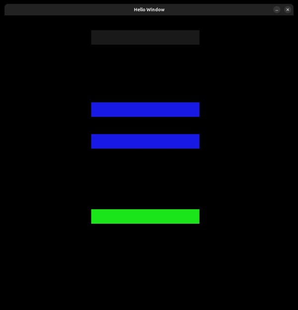
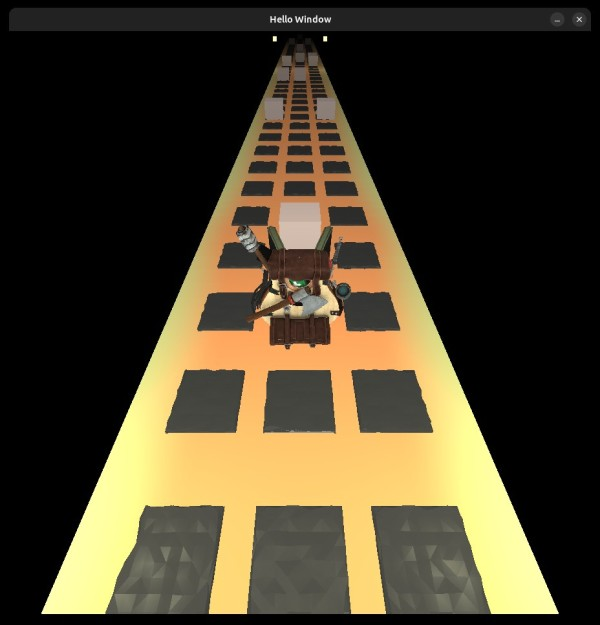
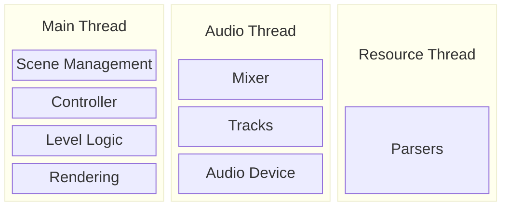
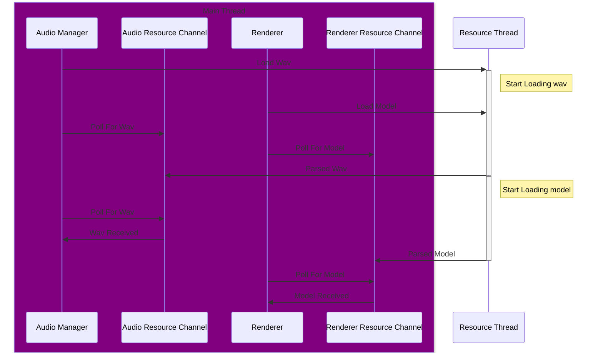

# Missed Beat (Placeholder Name)

## Build
### Prerequisites
- Install rust. [Instructions here](https://www.rust-lang.org/tools/install).
- Install cmake, it's a build dependency of a dependency. [Download here](https://cmake.org/download/).

### Release build
`cargo run --release`

### Debug Build
`cargo run`

### Package
Haven't tried packaging yet.

## Controls
On the main menu click on the blue squares to enter levels and the green square
to quit.
I haven't yet implemented text rendering.

- Left and right arrow keys to move the backpack and dodge the cubes.
- "Esc" to enter the menu.
- If you have hit a cube press "r" to reset the level

## Structure
### Overall

### Resource Management
For ease with the borrow checker systems (e.g. Audio, Renderer etc) own their
resources. Each system requests the resource it wants from the resource manager,
the resource and ownership of that resource is passed back to that system.

For example:

Each system has to keep track of transient resources that are specific to a
scene and clean up unused resources. Since each system owns it's own resources
the main game loop must ask each system if it's ready when loading a level.

A downside to this is sharing resources between systems would get messy.
You could imagine wanting to share resources to do things like render the
wave form in the UI. An alternate approach that would make having multiple
resource readers easier would be to have a contiguous block of memory that does
not move owned by the resource manager and other resources get references from
the resource manager. The resource manager would treat this as a stack, pushing
on resources for a scene then when changing scenes it can just move the pointer back.
Rust will likely not like the lifetime implications of this,
the lifetimes would be related to scenes which might not be possible to encode.
I would like to try this at some point but making the compiler happy with me
referencing this data across threads sounds like a rabbit hole.

### Audio
The audio system is comprised of:
- An Audio Manager running on the main thread. This manages the loading of resources and
provides a place for other systems to send commands to the audio channel
- A Mixer running on it's own thread that keeps track of the state of tracks and calculating how they interact.
- A Device that receives values from the mixer at a consistent rate.
### Rendering
Draws objects and UI based on the current game state. Currently this does a draw
per shader every frame. These shaders are split into object models, ui elements and
light sources (there's no reason not to roll the light shader into the model shader).

### Game State
The game state manages the other systems. The main loop consists of:
1. Collecting User Input
2. Calling the scene specific update function
3. Audio update
4. Render Update

The main game state also initiates the shutdown and cleanup (work in progress) of
the subsystems.

#### Scene Manager
This handles calling the update function for the current scene and transitioning
between the scenes. "scenes" refer to the different types of scenes with distinct
logic, the maps themselves would all be the "level" scene. Level State (e.g. loading, running)
may be a more apt term for how this is used.